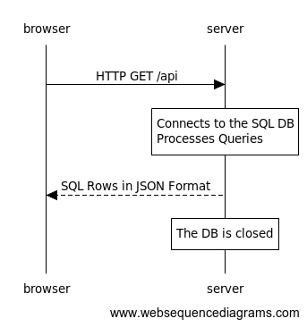

## How to Use
1. Create an account on MongoDB Atlas and follow the instructions to create a new cluster and set up a database.
2. Create a dotenv file in the root of repository and paste the provided connection string as:

   `MONGODB_URI = <Your connection string goes here>`

## Process Overview

### API GET Request Handling

## Attribution:
